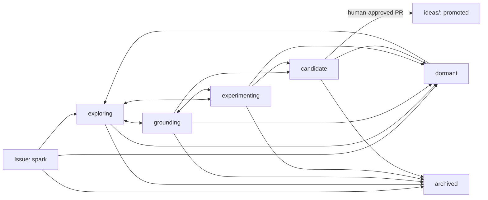

# Ideas Worth Building

> **Code is becoming cheaper. Judgment is not.**

Agentic coding is reducing the effort required to produce working software. That changes the bottleneck. The scarce resources are increasingly judgment, taste, originality, grounded understanding, and the ability to recognize what genuinely deserves to exist.

**Ideas Worth Building** is a public workshop for discovering, challenging, refining, and curating project ideas before large amounts of code are produced.

It is deliberately easy to bring in an incomplete or unconventional spark. It is deliberately difficult to promote one into the curated collection.

## The governing principle

> You may start with a problem, an idea, a capability, an observation, a desired experience, a prototype, or something whose purpose is not yet understood. You do not need to manufacture a problem statement. However, before a proposal is promoted, it must demonstrate who or what it serves, why that matters, and why this is a good response.

A proposal may be useful, beautiful, playful, civic, scientific, artistic, infrastructural, educational, commercial, or hard to classify. “Who or what it serves” may be a person, a community, an institution, a practice, an ecosystem, a body of knowledge, a technical system, or a desired human experience.

## The repository model

> **Issues are the repository's working memory. The Git repository is its curated memory.**

- A GitHub Issue is the living working representation of a proposal.
- Comments contribute research, critique, alternatives, experiments, synthesis, and design judgment.
- The Issue body should be revised as understanding improves; it is not merely an immutable submission form.
- A pull request is a promotion case: a proposal to capture a sufficiently developed idea under [`ideas/`](ideas/).
- The files under [`ideas/`](ideas/) are concise, attributable, version-controlled syntheses—not exports of entire Issue threads.
- GitHub Discussions are optional and outside the core workflow.

GitHub's native custom issue types are organization-level. This repository therefore uses portable labels such as `type:proposal` and `type:problem` as its canonical classification, even if native issue types are added later.

## What may enter

A proposal can begin with any of the following:

- a problem or frustration;
- an observation or anomaly;
- a new technical capability;
- a desired experience;
- a prototype that reveals an unexpected possibility;
- a design principle;
- a combination of existing concepts;
- an idea whose purpose is still unclear.

Uncertainty is acceptable. Fabrication is not. Contributors must not invent users, pain points, evidence, demand, or market narratives merely to make an idea look complete.

## What this is not

This repository is not:

- an uncurated list of generated ideas;
- a startup-name or “AI wrapper” factory;
- a popularity contest or reaction leaderboard;
- a backlog where every entry is expected to be built;
- a place where a polished pitch substitutes for substance;
- a process that rewards submission volume;
- a requirement to translate every intuition into problem-statement theatre.

A high-volume stream of plausible-sounding ideas makes the repository worse. One careful improvement to an existing proposal is usually more valuable than ten new Issues.

## What success looks like

The repository succeeds when it helps contributors make better judgments: a vague spark becomes precise without becoming conventional; research changes a proposition; critique exposes a fatal flaw early; an experiment replaces speculation with learning; two near-duplicates become one stronger line of inquiry; or a proposal is deliberately not built for a well-recorded reason.

Issue count, stars, reactions, generated text, and lines of code are not success measures. A small curated collection with clear lineage and serious dissent is preferable to a large catalogue of plausible concepts.

## Proposal lifecycle

A proposal has exactly one `status:*` label.

| Status | Meaning |
|---|---|
| `status:spark` | A newly captured starting point. It may be fragmentary. |
| `status:exploring` | The proposition, boundaries, relationships, and alternatives are being shaped. |
| `status:grounding` | Claims, beneficiaries, present behaviour, evidence, and assumptions are being tested. |
| `status:candidate` | A human curator believes the proposal may meet the promotion boundary and has invited focused review. |
| `status:experimenting` | A meaningful experiment or prototype is actively producing information. This can occur before or after grounding. |
| `status:promoted` | A human-approved promotion pull request has been merged into `ideas/`. |
| `status:dormant` | Work has paused, but the proposal remains potentially valuable and may be revived. |
| `status:archived` | A human has closed the active line of inquiry with a recorded reason. It may still be revisited if material new information appears. |

The states are descriptive, not a compulsory linear funnel. Exploration, grounding, and experimentation may loop. Agents may recommend `candidate`, `promoted`, `dormant`, or `archived`; they do not decide those states autonomously.



## The promotion boundary

Promotion is not an award for effort and not a prediction of commercial success. It means that the repository's human curators judge the proposal to be worth preserving as a serious, distinctive candidate for creation or further exploration.

A proposal must make a convincing case across four dimensions:

1. **Meaning** — who or what it serves, what changes for them or it, and why that change matters.
2. **Grounding** — current behaviours and alternatives are represented honestly; externally verifiable claims are cited; facts, assumptions, and speculation are separated.
3. **Distinctiveness** — the non-obvious insight, synthesis, mechanism, or experiential ambition is clear. “Use AI” or “make it easier” is not sufficient.
4. **Excellence and learning** — the qualities that would make an implementation excellent are articulated, major uncertainties are visible, and a smallest meaningful exploration is available.

There is no numeric score that can replace curator judgment. Reactions and comment volume may reveal interest, but they never determine promotion.

See [`patterns/quality-signals.md`](patterns/quality-signals.md) and [`GOVERNANCE.md`](GOVERNANCE.md).

## Ways to contribute

A contribution does not have to be a new proposal. Useful contribution modes include:

- finding and explaining a likely duplicate or adjacent proposal;
- strengthening the proposition without inflating it;
- researching current behaviour, alternatives, prior art, or technical feasibility;
- identifying the strongest counterargument or failure mode;
- clarifying the non-obvious insight;
- describing what excellent execution would feel like;
- designing a smaller, more informative experiment;
- synthesizing a long thread into a revised Issue body;
- preparing a promotion pull request after a human recommendation.

Substantive disagreement is welcome. Generic approval, generic rejection, and agent-generated praise are not useful contributions.

## When an idea becomes a build

This repository curates proposals; it is not the implementation monorepo for every promoted idea. A prototype may be linked or used as evidence, but substantial product code should normally live in a separate repository with its own maintainers, license, safety model, and delivery choices.

Anyone may decide to explore or build a public proposal subject to the applicable rights and licenses. Promotion does not allocate exclusive ownership, funding, or an official implementer. Builders should link the new project from the source Issue, credit material lineage, and feed decision-relevant learning back into the proposal.

## Starting a proposal

1. Read [`principles/`](principles/) and [`CONTRIBUTING.md`](CONTRIBUTING.md).
2. Search open **and closed** Issues using the title, synonyms, underlying capability, desired experience, and adjacent concepts.
3. Prefer improving an existing Issue when the distinctive delta is small.
4. Open the Proposal form. Only **the spark** and **the proposition** are required; uncertainty is permitted everywhere else.
5. Apply or suggest an optional `origin:*` label when helpful.

A standalone problem or frustration may be opened with the Problem form. A proposal does not have to reference a `type:problem` Issue.

## Working with AI agents

This repository is designed to be operated through `gh`, the GitHub API, and coding agents.

Agents must read [`AGENTS.md`](AGENTS.md) before acting. They are especially useful for duplicate detection, research, critique, risk analysis, experiment design, synthesis, and pull-request preparation. Humans retain responsibility for deciding whether a proposal matters, is distinctive, demonstrates taste, and deserves promotion.

The repository includes a small dependency-free helper. For agent-created proposals, it uses a two-step machine contract: validate and inspect the open-and-closed Issue search first, then explicitly confirm that the results were reviewed before creation.

```bash
# Prepare machine-readable input from the example
cp .github/agent-templates/proposal-input.example.json proposal.json

# Validate the input, repeat its duplicate searches, and preview the Issue
python scripts/iwb.py create-proposal --input proposal.json --check-only

# Create exactly one reviewed proposal
python scripts/iwb.py create-proposal --input proposal.json \
  --confirm-reviewed-search-results

# Search open and closed Issues directly
python scripts/iwb.py search "ambient computing for meetings"

# Apply or update the canonical labels after repository creation
python scripts/iwb.py bootstrap-labels --repo OWNER/ideas-worth-building

# Change one ordinary lifecycle label while removing the previous status label
python scripts/iwb.py transition 42 status:grounding --reason "Starting source verification"

# Protected decisions require an explicit human rationale
python scripts/iwb.py transition 42 status:candidate \
  --human-approved \
  --reason "Curator review invited; strongest open question is the adoption mechanism"

# Prepare, but do not approve, a promotion document from an Issue
python scripts/iwb.py prepare-promotion 42 --slug meaningful-slug --curator @OWNER

# Validate repository structure and curated idea documents
python scripts/iwb.py validate
```

The helper automates mechanics, not judgment. Direct GitHub API clients should treat [`schemas/proposal-input.schema.json`](schemas/proposal-input.schema.json), [`.github/labels.json`](.github/labels.json), and the body headings in [`SCHEMA.md`](SCHEMA.md) as the portable contract. They must preserve the same open-and-closed search, no-fabrication, disclosure, and human-decision boundaries rather than bypassing them.

## Repository map

| Path | Purpose |
|---|---|
| [`principles/`](principles/) | Durable principles that govern contribution and curation. |
| [`ideas/`](ideas/) | Human-promoted, version-controlled idea syntheses. |
| [`patterns/`](patterns/) | Reusable quality, critique, contribution, and experiment patterns. |
| [`decisions/`](decisions/) | Architecture and governance decision records for the repository itself. |
| [`archive/`](archive/) | Previously curated artifacts that have been retired or superseded. Closed Issues remain on GitHub. |
| [`.github/ISSUE_TEMPLATE/`](.github/ISSUE_TEMPLATE/) | Proposal, problem, and governance forms. |
| [`.github/agent-templates/`](.github/agent-templates/) | Reusable instructions for agent-assisted contributions. |
| [`scripts/`](scripts/) | Deterministic helpers for machine intake, labels, search, lifecycle mechanics, promotion drafts, and validation. |
| [`schemas/`](schemas/) | Machine-readable input contracts for agent workflows. |

## Public contribution and licensing

Everything submitted to Issues, pull requests, and repository files is public. Do not submit confidential, proprietary, security-sensitive, personally identifying, or patent-sensitive information.

Unless otherwise stated, prose and idea documentation are licensed under **Creative Commons Attribution 4.0 International**. Software and automation files are licensed under the **MIT License**. See [`LICENSE`](LICENSE).

The licenses apply to the expression contributed here. They do not guarantee that an underlying idea is novel, unencumbered, safe, viable, or free of third-party rights. Contributors remain responsible for what they disclose.
